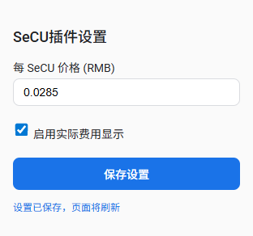
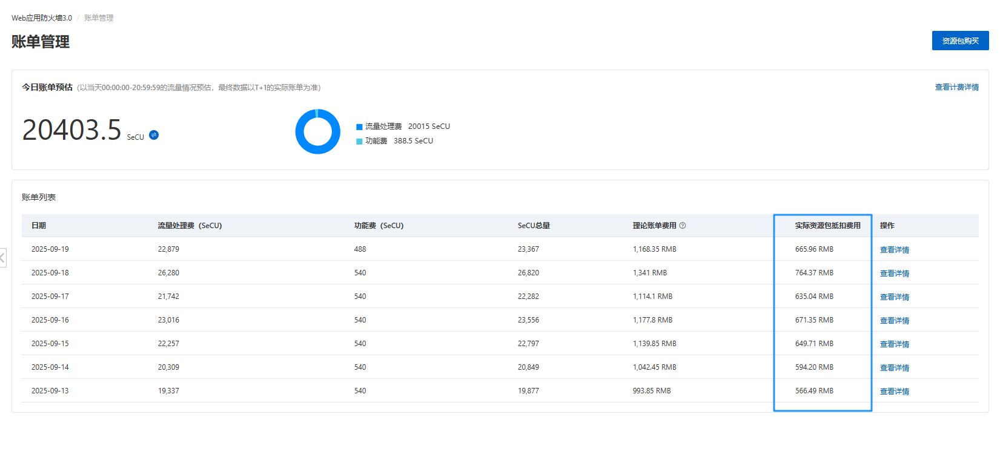

# SeCU Helper

一个 Chrome 浏览器插件，用于在阿里云WAF控制台-账单管理页面的账单列表中自动计算并展示 **实际资源包抵扣费用**。  
插件可以根据用户配置的 **每 SeCU 价格**，实时计算费用并渲染到表格中，提升使用效率。

---

## ✨ 功能特性
- 在原有表格中自动新增 **实际资源包抵扣费用** 列。
- 根据 **每 SeCU 价格** 自动计算费用并展示。
- 支持在插件设置中修改 SeCU 单价，保存后自动刷新页面。
- 一键开关功能，随时启用/禁用费用列展示。
- UI风格简洁、美观。

---

## 📦 安装方法
1. 克隆本仓库到本地：
```bash
git clone https://github.com/yourname/secu-helper.git

```
2. 打开 Chrome 浏览器，进入扩展管理页面：

```bash
chrome://extensions/
```

3. 打开右上角 开发者模式。

4. 点击 加载已解压的扩展程序。

5. 选择本项目的目录，即可完成安装。

⚙️ 使用方法
1. 安装完成后，在 Chrome 右上角找到插件图标。

2. 点击图标打开插件设置页面：

 - 输入 每 SeCU 价格（例如 0.0285）。

 - 点击保存，页面会自动刷新并生效。

 - 通过开关按钮随时启用/关闭功能。

3. 返回表格页面，即可看到新增加的 实际资源包抵扣费用 列。

🖼️ 截图

插件界面示例

**插件设置页面**  



**表格展示效果**  


🔧 文件结构
```bash
secu-helper/
├── manifest.json         # 插件配置文件
├── content.js            # 表格渲染逻辑
├── popup.html            # 插件设置页面
├── popup.js              # 设置交互逻辑
├── style.css             # 风格样式
└── README.md             # 使用说明
```

🛠️ 开发说明

- 本插件基于 Manifest V3 开发。

- 如需修改逻辑，可直接在 content.js 中调整表格处理方法。

- 重新加载插件后即可看到效果。

---
📜 License
MIT License © 2025

---